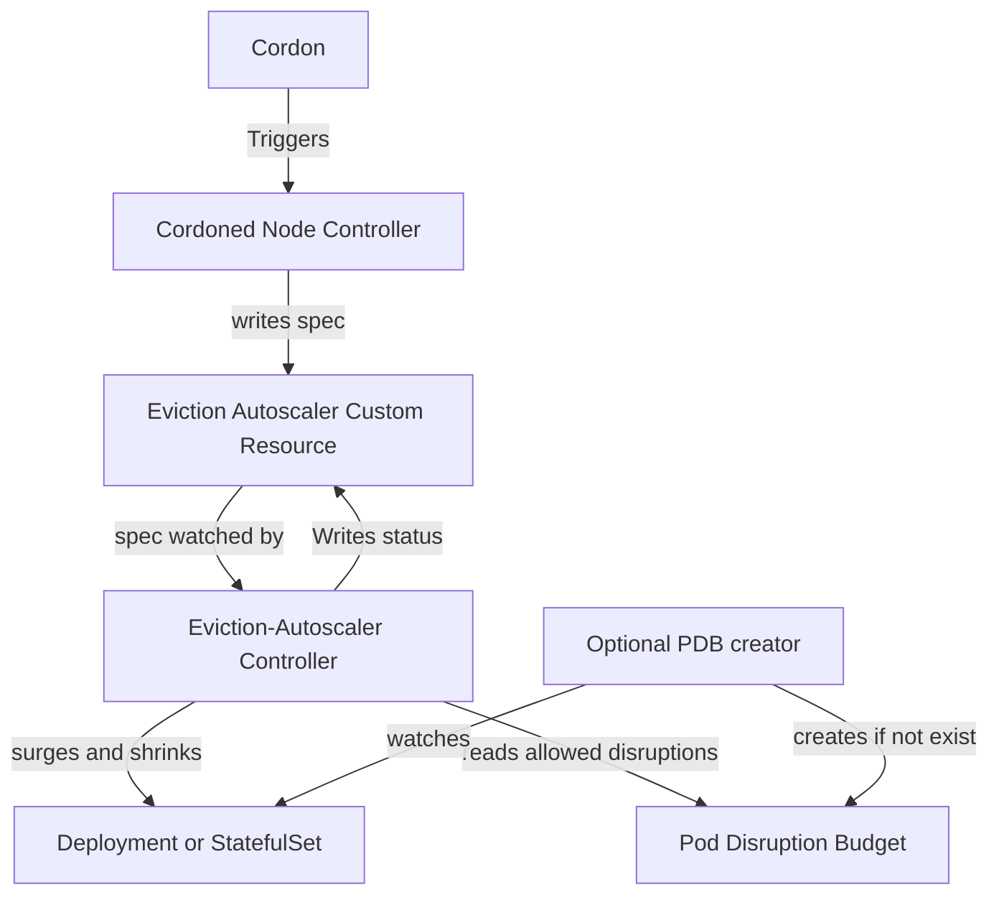

# Eviction-Autoscaler

[](https://goreportcard.com/report/github.com/azure/eviction-autoscaler)
[](https://pkg.go.dev/github.com/azure/eviction-autoscaler)
[](LICENSE)
[](https://github.com/azure/eviction-autoscaler/actions/workflows/ci.yml)

## Table of Contents

- [Introduction](#introduction)
- [Features](#features)
- [Installation](#installation)
- [Usage](#usage)

## Introduction

Kubernetes (k8s) deployments already have a max surge concept, and there's no reason this surge should only apply to new rollouts and not to node maintenance or other situations where PodDisruptionBudget (PDB)-protected pods need to be evicted.
This project uses node cordons to signal eviction-autoscaler Custom Resources that correspond to a PodDisruptionBudget and target a deployment. An eviction autoscaler controller then attempts to scale up a the targeted deployment (or scaleset if you're feeling brave) when the pdb's allowed disruptions is zero and scales down once evictions have stopped.

### Why Not Overprovision?

Overprovisioning isn't free. Sometimes it makes sense to run as cost-effectively as possible, but you still don't want to experience downtime due to a cluster upgrade or even a VM maintenance event.  

Your app might also experience issues for unrelated reasons, and a maintenance event shouldn't result in downtime if adding extra replicas can save you.

## Features

- **Node Controller**: Signals eviction-autoscaler for all pods on cordoned nodes selected by corresponding pdb whose name/namespace it shares.
- **Eviction-autoscaler Controller**: Watches eviction-autoscale resources. If there a recent eviction singals and the PDB's AllowedDisruotions is zero, it triggers a surge in the corresponding deployment. Once evitions have stopped for some cooldown period and allowed diruptions has rised above zero it scales down.
- **PDB Controller** (Optional): Automatically creates eviction-autoscalers Custom Resources for existing PDBs.
- **Deployment Controller** (Optional): Creates PDBs for deployments that don't already have them and keeps min available matching the deployments replicas (not counting any surged in by eviction autoscaler)



## Installation

### Prerequisites

- Docker
- kind for e2e tests.
- A sense of adventure

### Install

You can install Eviction-Autoscaler using the Azure Kubernetes Extension Resource Provider (RP) or via Helm.

### Install via Helm

1. Add the eviction-autoscaler Helm repository:

    ```bash
    helm repo add eviction-autoscaler https://azure.github.io/eviction-autoscaler/charts
    helm repo update
    ```

2. Install the chart into your cluster:

    ```bash
    helm install eviction-autoscaler eviction-autoscaler/eviction-autoscaler \
          --namespace eviction-autoscaler --create-namespace \
          --set pdb.create=true
    ```

> **Note:** Setting `pdb.create=true` will automatically create a PodDisruptionBudget (PDB) for deployments that do not already have one, ensuring your workloads are protected and enabling eviction-autoscaler to manage disruptions effectively.
>
> If a deployment already has a PDB whose label selector matches the deployment's pod template labels, eviction-autoscaler will **not** create a new PDB—even if `pdb.create=true`. This avoids duplicate PDBs and ensures existing disruption budgets are respected.
>
> For example, if you deploy an app without a PDB:
>
> ```yaml
> apiVersion: apps/v1
> kind: Deployment
> metadata:
>   name: my-app
>   namespace: default
> spec:
>   replicas: 2
>   selector:
>     matchLabels:
>       app: my-app
>   template:
>     metadata:
>       labels:
>         app: my-app
>     spec:
>       containers:
>       - name: my-app
>         image: nginx
> ```
>
> With `pdb.create=true`, eviction-autoscaler will automatically create a matching PDB:
>
> ```yaml
> apiVersion: policy/v1
> kind: PodDisruptionBudget
> metadata:
>   name: my-app
>   namespace: default
> spec:
>   minAvailable: 2
>   selector:
>     matchLabels:
>       app: my-app
> ```
>
> If a matching PDB already exists, eviction-autoscaler will not create another. If you later disable `pdb.create`, eviction-autoscaler will not delete any existing PDBs—it will simply stop creating new ones.

3. (Optional) Customize values by passing `--values my-values.yaml` or using `--set key=value`.

Refer to the [Helm Values](https://github.com/Azure/eviction-autoscaler/blob/main/helm/eviction-autoscaler/values.yaml) for configuration options.

### Install via Azure Kubernetes Extension RP

Follow the steps below to register the required features and deploy the extension to your AKS cluster.

#### 1. Register the Extensions Feature

```bash
az feature register --namespace Microsoft.KubernetesConfiguration --name Extensions
```

Wait until the feature state is `Registered`:

```bash
az feature show --namespace Microsoft.KubernetesConfiguration --name Extensions
```

#### 2. Register the Kubernetes Configuration Provider

```bash
az provider register -n Microsoft.KubernetesConfiguration
```

#### 3. Create an AKS Cluster (example)

```bash
az aks create \
        --resource-group <your-resource-group> \
        --name <your-aks-cluster-name> \
        --node-count 2 \
        --generate-ssh-keys
```

#### 4. Deploy the Eviction-Autoscaler Extension

```bash
az k8s-extension create \
    --cluster-name <your-cluster-name> \
    --cluster-type managedClusters \
    --extension-type microsoft.evictionautoscaler \
    --name <your-extension-name> \
    --resource-group <your-resource-group-name> \
    --release-train dev \
    --config AgentTimeoutInMinutes=30 \
    --subscription <your-subscription-id> \
    --version 0.1.2 \
    --auto-upgrade-minor-version false
```

> **Note:** The `--configuration-settings pdb.create=true` option enables automatic creation of PodDisruptionBudgets (PDBs) for deployments that do not already have one. ensuring your workloads are protected and enabling eviction-autoscaler to manage disruptions effectively. Eviction-autoscaler determines whether a deployment already has a corresponding PDB by comparing the PDB’s label selector with the deployment’s pod template labels. This ensures that each deployment is protected from disruptions and avoids duplicate PDBs. If you later disable `pdb.create`, eviction-autoscaler will not delete any existing PDBs—it will simply stop creating new ones.
> **Note:** The `--auto-upgrade-minor-version false` option is only required if you want to disable automatic minor version upgrades.
> **Note:** The `--release-train dev` option specifies that the extension will use the "dev" release train, which typically includes the latest development builds and experimental features.  
> Other available release train options include `stable` (recommended for production workloads) and `preview` (for pre-release features).  
> Use `dev` for testing or development environments, `preview` for evaluating upcoming features, and `stable` for production deployments.

Refer to the [extension documentation](https://github.com/azure/eviction-autoscaler/tree/main/charts/eviction-autoscaler) for configuration options.

Configuration options will be documented here in future updates. If you have suggestions, please open an issue or PR.

### Excluding Deployments from Automatic PDB Creation

If you want to exclude a specific deployment from automatic PodDisruptionBudget (PDB) creation, add the following annotation to its manifest:

```yaml
metadata:
    annotations:
        eviction-autoscaler.azure.com/pdb-create: "false"
```

This annotation instructs eviction-autoscaler not to create a PDB for that deployment, regardless of whether you installed via Helm or the Azure Kubernetes Extension Resource Provider.

### Deployments with MaxUnavailable

Eviction-autoscaler automatically skips PDB creation for deployments that have a `maxUnavailable` value other than 0 in their rolling update strategy. This is because such deployments already tolerate some level of downtime during updates or maintenance.

For example, the following deployment will **not** get an automatic PDB:

```yaml
apiVersion: apps/v1
kind: Deployment
metadata:
  name: my-app
spec:
  replicas: 3
  strategy:
    type: RollingUpdate
    rollingUpdate:
      maxSurge: 25%           # This doesn't affect PDB creation
      maxUnavailable: 1       # Allows 1 pod to be unavailable - skips PDB creation
  # ... rest of spec
```

In this case, since `maxUnavailable: 1`, the deployment is explicitly designed to tolerate one pod being down. Creating a PDB would conflict with this configuration. Note that `maxSurge` does not affect PDB creation - only `maxUnavailable` matters.

If you want a PDB for such a deployment, you can either:
- Set `maxUnavailable: 0` in the deployment strategy, or
- Manually create and manage the PDB yourself

This behavior applies to both integer values (`maxUnavailable: 1`) and percentage values (`maxUnavailable: 25%`). Only deployments with `maxUnavailable: 0` or `maxUnavailable: 0%` will automatically get PDBs created.

### Namespace Control: enabled_by_default Configuration

Eviction autoscaler provides flexible namespace-level control with two operational modes controlled by environment variables:

#### Environment Variables

- **`ENABLED_BY_DEFAULT`**: Controls the operational mode (default: `false`)
  - `false`: Namespaces disabled by default - only specified namespaces enabled
  - `true`: Namespaces enabled by default - all namespaces enabled unless disabled
- **`ACTIONED_NAMESPACES`**: Comma-separated list of namespaces with special behavior
- **`PDB_CREATE`**: Enable automatic PDB creation for deployments (default: `false`)

#### Mode 1: `ENABLED_BY_DEFAULT=false` (Default)

When `ENABLED_BY_DEFAULT=false` (the default), eviction autoscaler operates as follows:

- **All namespaces are disabled by default**
- Namespaces listed in **`ACTIONED_NAMESPACES`** are **automatically enabled**
- Other namespaces can be **enabled** by adding the annotation `eviction-autoscaler.azure.com/enable: "true"`
- Namespaces in `ACTIONED_NAMESPACES` can be **overridden** with annotation `eviction-autoscaler.azure.com/enable: "false"`

**Configuration via Helm:**

```bash
helm install eviction-autoscaler eviction-autoscaler/eviction-autoscaler \
  --namespace eviction-autoscaler --create-namespace \
  --set controllerConfig.pdb.create=true \
  --set controllerConfig.namespaces.enabledByDefault=false \
  --set-json 'controllerConfig.namespaces.actionedNamespaces=["kube-system","production","staging"]'
```

Or via values.yaml:

```yaml
controllerConfig:
  pdb:
    create: true
  namespaces:
    enabledByDefault: false  # Namespaces disabled by default (default)
    actionedNamespaces:
      - kube-system
      - production
      - staging
```

**Configuration via environment variables:**

```bash
export ENABLED_BY_DEFAULT=false
export ACTIONED_NAMESPACES="kube-system,production,staging"
```

**Enabling a namespace when enabled_by_default=false:**

```yaml
apiVersion: v1
kind: Namespace
metadata:
  name: development
  annotations:
    eviction-autoscaler.azure.com/enable: "true"  # Explicitly enable
```

Or using kubectl:

```bash
kubectl annotate namespace development eviction-autoscaler.azure.com/enable=true
```

#### Mode 2: `ENABLED_BY_DEFAULT=true`

When `ENABLED_BY_DEFAULT=true` is set, eviction autoscaler operates as follows:

- **All namespaces are enabled by default**
- **`ACTIONED_NAMESPACES` is ignored** - only annotations control which namespaces are disabled
- Namespaces can be **disabled** by adding the annotation `eviction-autoscaler.azure.com/enable: "false"`
- Namespaces can be **explicitly enabled** with annotation `eviction-autoscaler.azure.com/enable: "true"` (though they're already enabled by default)

**Configuration via Helm:**

```bash
helm install eviction-autoscaler eviction-autoscaler/eviction-autoscaler \
  --namespace eviction-autoscaler --create-namespace \
  --set controllerConfig.pdb.create=true \
  --set controllerConfig.namespaces.enabledByDefault=true
```

Or via values.yaml:

```yaml
controllerConfig:
  pdb:
    create: true
  namespaces:
    enabledByDefault: true  # Namespaces enabled by default
    actionedNamespaces: []   # Ignored when enabled_by_default=true
```

**Configuration via environment variables:**

Set the environment variable `ENABLED_BY_DEFAULT=true`.

**Disabling a namespace when enabled_by_default=true:**

```yaml
apiVersion: v1
kind: Namespace
metadata:
  name: development
  annotations:
    eviction-autoscaler.azure.com/enable: "false"  # Explicitly disable
```

Or using kubectl:

```bash
kubectl annotate namespace development eviction-autoscaler.azure.com/enable=false
```

**Enabling a namespace not in the list:**

```yaml
apiVersion: v1
kind: Namespace
metadata:
  name: development
  annotations:
    eviction-autoscaler.azure.com/enable: "true"  # Explicitly enable
```

#### Configuration Comparison

| Mode | `ENABLED_BY_DEFAULT` | Default Behavior | `ACTIONED_NAMESPACES` | Annotation Behavior |
|------|---------------------|------------------|----------------------|---------------------|
| **enabled_by_default=false** (default) | `false` or unset | All disabled | These namespaces are enabled | Can enable others with `enable: "true"` or override with `enable: "false"` |
| **enabled_by_default=true** | `true` | All enabled | Ignored | Can disable with `enable: "false"` |

**Important:** Annotations always take precedence over the default behavior and the `ACTIONED_NAMESPACES` list.

### Resource Cleanup and Deletion Behavior

When eviction-autoscaler is disabled for a namespace (either by annotation or configuration change), resources are automatically cleaned up based on their ownership:

#### Controller-Owned Resources (created by eviction-autoscaler)

Resources created by eviction-autoscaler with the `ownedBy: EvictionAutoScaler` annotation are fully managed by the controller:

1. **When a namespace is disabled:**
   - The `DeploymentToPDBReconciler` detects the namespace is disabled
   - It deletes all controller-owned PDBs in that namespace
   - The `EvictionAutoScaler` CRs are automatically deleted by Kubernetes garbage collection (via OwnerReference)

2. **When a deployment is deleted:**
   - The PDB is automatically deleted (via OwnerReference: PDB → Deployment)
   - The `EvictionAutoScaler` CR is automatically deleted (via OwnerReference: EvictionAutoScaler → PDB)

**Example of controller-owned resources:**

```bash
# PDB created by eviction-autoscaler
kubectl get pdb my-app -o yaml
# metadata:
#   annotations:
#     ownedBy: EvictionAutoScaler
#   ownerReferences:
#   - apiVersion: apps/v1
#     kind: Deployment
#     name: my-app
```

#### User-Owned Resources (manually created)

Resources created manually without the `ownedBy: EvictionAutoScaler` annotation are preserved:

1. **When a namespace is disabled:**
   - The `PDBToEvictionAutoScalerReconciler` deletes only the `EvictionAutoScaler` CR
   - **Your manually created PDB is left intact** - eviction-autoscaler never deletes resources it doesn't own

2. **When a deployment is deleted:**
   - If the PDB has no OwnerReference (user-owned), it remains untouched
   - Only the `EvictionAutoScaler` CR is deleted

**Example of user-owned PDB:**

```bash
# User creates their own PDB
kubectl apply -f - <<EOF
apiVersion: policy/v1
kind: PodDisruptionBudget
metadata:
  name: my-app
  namespace: default
spec:
  minAvailable: 2
  selector:
    matchLabels:
      app: my-app
EOF

# Eviction-autoscaler creates an EvictionAutoScaler CR but does NOT take ownership of the PDB
# If namespace is disabled, only the EvictionAutoScaler CR is deleted - the PDB remains
```

#### Performance Note

Namespace watches trigger reconciliation by listing all deployments/PDBs in that namespace. This is efficient because:
- The controller-runtime client uses an **in-memory cache**
- List operations read from cache, not the Kubernetes API server
- No API server round-trip overhead
- Fast local memory operations

#### Example: enabled_by_default=false Configuration

**Via Helm:**

```bash
helm install eviction-autoscaler eviction-autoscaler/eviction-autoscaler \
  --namespace eviction-autoscaler --create-namespace \
  --set controllerConfig.pdb.create=true \
  --set controllerConfig.namespaces.enabledByDefault=true \
  --set-json 'controllerConfig.namespaces.actionedNamespaces=["kube-system","production"]'
```

**Via environment variables:**

Deploy with environment variables:

```yaml
apiVersion: apps/v1
kind: Deployment
metadata:
  name: eviction-autoscaler
  namespace: eviction-autoscaler
spec:
  template:
    spec:
      containers:
      - name: manager
        env:
        - name: ENABLED_BY_DEFAULT
          value: "true"
        - name: ACTIONED_NAMESPACES
          value: "kube-system,production,staging"
        - name: PDB_CREATE
          value: "true"
```

Deployments in `production` and `staging` namespaces will be managed by eviction autoscaler. Deployments in other namespaces (e.g., `development`, `testing`) will be ignored.

### PDB Ownership and Lifecycle Management

When eviction-autoscaler creates a PodDisruptionBudget (PDB) for a deployment, it manages the PDB's lifecycle using both Kubernetes owner references and annotations:

- **Owner Reference**: Links the PDB to its deployment, ensuring the PDB is deleted when the deployment is deleted
- **Annotation**: `ownedBy: EvictionAutoScaler` marks the PDB as managed by eviction-autoscaler

#### Taking Manual Control of a PDB

If you want to take manual control of a PDB that was created by eviction-autoscaler, remove the `ownedBy` annotation:

```bash
kubectl annotate pdb <pdb-name> -n <namespace> ownedBy-
```

When the annotation is removed, eviction-autoscaler will:
1. Detect the annotation removal (which triggers reconciliation)
2. Remove the owner reference from the PDB
3. Stop managing the PDB

After this, the PDB becomes user-managed and will **not** be deleted when the deployment is deleted. You take full responsibility for managing and cleaning up the PDB.

**Example workflow:**

```bash
# Check the current PDB annotations
kubectl get pdb my-app -n default -o jsonpath='{.metadata.annotations}'

# Remove the ownedBy annotation to take control
kubectl annotate pdb my-app -n default ownedBy-

# The PDB is now yours to manage
# Deleting the deployment will no longer delete the PDB
kubectl delete deployment my-app -n default

# You must manually delete the PDB when you're done with it
kubectl delete pdb my-app -n default
```

**Re-establishing controller ownership:**

If you want eviction-autoscaler to take control back of a PDB, simply add the annotation back:

```bash
# Add the annotation back to return control to eviction-autoscaler
kubectl annotate pdb my-app -n default ownedBy=EvictionAutoScaler

# The controller will re-establish the owner reference on the next reconciliation
# The PDB will now be deleted when the deployment is deleted
```

## Usage

```bash
kubectl create ns laboratory
kubectl create deployment -n laboratory piggie --image nginx
# unless disabled there will now be a pdb and a pdbwatcher that map to the deployment
# show a starting state
kubectl get pods -n laboratory
kubectl get poddisruptionbudget piggie -n laboratory -o yaml # should be allowed disruptions 0
kubectl get evictionautoscalers piggie -n laboratory -o yaml
# cordon
NODE=$(kubectl get pods -n laboratory -l app=piggie -o=jsonpath='{.items[*].spec.nodeName}')
kubectl cordon $NODE
# show we've scaled up
kubectl get pods -n laboratory
kubectl get poddisruptionbudget piggie -n laboratory -o yaml # should be allowed disruptions 1
kubectl get evictionautoscalers piggie -n laboratory -o yaml
# actually kick the node off now that pdb isn't at zero.
kubectl drain $NODE --delete-emptydir-data --ignore-daemonsets

```

Here's a drain of  Node on a to node cluster that is running the [aks store demo](https://github.com/Azure-Samples/aks-store-demo) (4 deployments and two stateful sets). You can see the drains being rejected then going through on the left and new pods being surged in on the right.


## Shout out

This project originated as an intern project and is still available at [github.com/Javier090/k8s-pdb-autoscaler](https://github.com/Javier090/k8s-pdb-autoscaler).

## Contributing

This project welcomes contributions and suggestions.  Most contributions require you to agree to a
Contributor License Agreement (CLA) declaring that you have the right to, and actually do, grant us
the rights to use your contribution. For details, visit <https://cla.opensource.microsoft.com>.

When you submit a pull request, a CLA bot will automatically determine whether you need to provide
a CLA and decorate the PR appropriately (e.g., status check, comment). Simply follow the instructions
provided by the bot. You will only need to do this once across all repos using our CLA.

This project has adopted the [Microsoft Open Source Code of Conduct](https://opensource.microsoft.com/codeofconduct/).
For more information see the [Code of Conduct FAQ](https://opensource.microsoft.com/codeofconduct/faq/) or
contact [opencode@microsoft.com](mailto:opencode@microsoft.com) with any additional questions or comments.

## Trademarks

This project may contain trademarks or logos for projects, products, or services. Authorized use of Microsoft
trademarks or logos is subject to and must follow
[Microsoft's Trademark & Brand Guidelines](https://www.microsoft.com/en-us/legal/intellectualproperty/trademarks/usage/general).
Use of Microsoft trademarks or logos in modified versions of this project must not cause confusion or imply Microsoft sponsorship.
Any use of third-party trademarks or logos are subject to those third-party's policies.
