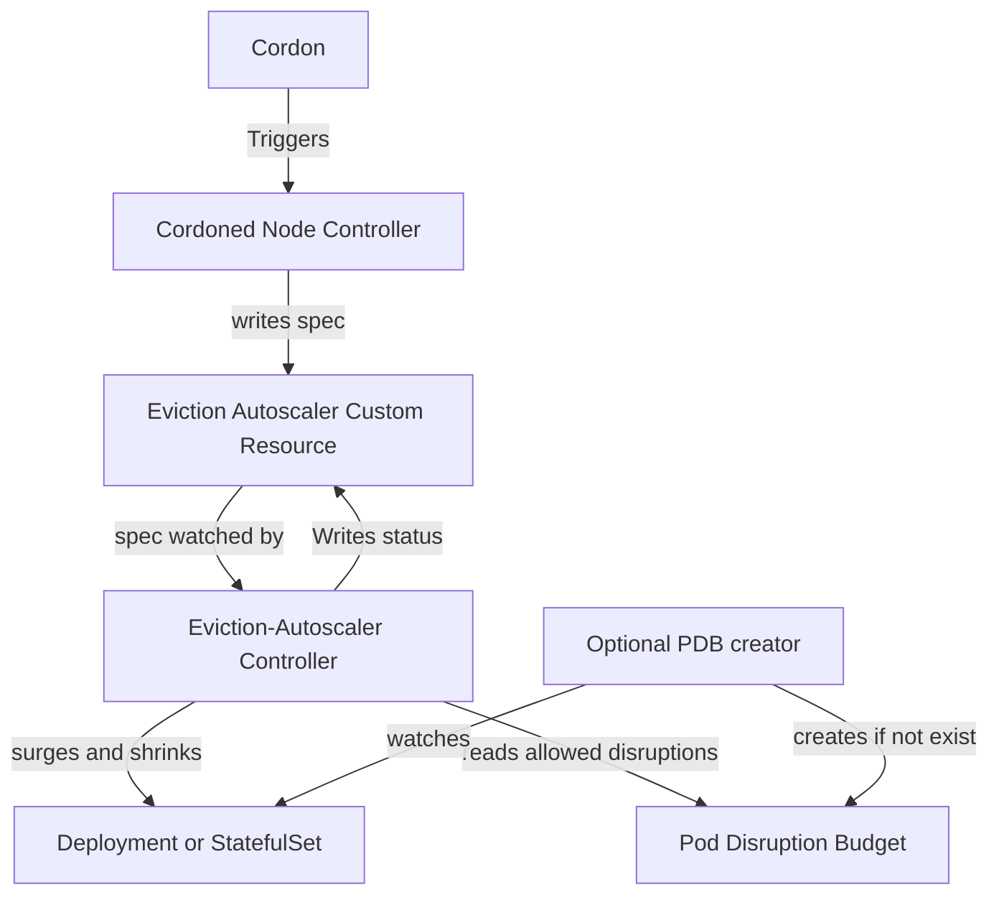

# Eviction-Autoscaler

[](https://goreportcard.com/report/github.com/azure/eviction-autoscaler)
[](https://pkg.go.dev/github.com/azure/eviction-autoscaler)
[](LICENSE)
[](https://github.com/azure/eviction-autoscaler/actions/workflows/ci.yml)

## Table of Contents

- [Introduction](#introduction)
- [Features](#features)
- [Installation](#installation)
- [Usage](#usage)

## Introduction

Kubernetes (k8s) deployments already have a max surge concept, and there's no reason this surge should only apply to new rollouts and not to node maintenance or other situations where PodDisruptionBudget (PDB)-protected pods need to be evicted.
This project uses node cordons to signal eviction-autoscaler Custom Resources that correspond to a PodDisruptionBudget and target a deployment. An eviction autoscaler controller then attempts to scale up a the targeted deployment (or scaleset if you're feeling brave) when the pdb's allowed disruptions is zero and scales down once evictions have stopped.

### Why Not Overprovision?

Overprovisioning isn't free. Sometimes it makes sense to run as cost-effectively as possible, but you still don't want to experience downtime due to a cluster upgrade or even a VM maintenance event.  

Your app might also experience issues for unrelated reasons, and a maintenance event shouldn't result in downtime if adding extra replicas can save you.

## Features

- **Node Controller**: Signals eviction-autoscaler for all pods on cordoned nodes selected by corresponding pdb whose name/namespace it shares.
- **Eviction-autoscaler Controller**: Watches eviction-autoscale resources. If there a recent eviction singals and the PDB's AllowedDisruotions is zero, it triggers a surge in the corresponding deployment. Once evitions have stopped for some cooldown period and allowed diruptions has rised above zero it scales down.
- **PDB Controller** (Optional): Automatically creates eviction-autoscalers Custom Resources for existing PDBs.
- **Deployment Controller** (Optional): Creates PDBs for deployments that don't already have them and keeps min available matching the deployments replicas (not counting any surged in by eviction autoscaler)



## Installation

### Prerequisites

- A Kubernetes cluster (AKS recommended for Azure Extension installation)
- Azure CLI (for Azure Extension installation)
- Helm 3.x (for Helm installation)

### Install via Azure Kubernetes Extension (Recommended)

The Azure Kubernetes Extension provides the simplest installation and management experience for AKS clusters.

#### 1. Register Required Features

```bash
az feature register --namespace Microsoft.KubernetesConfiguration --name Extensions
az feature show --namespace Microsoft.KubernetesConfiguration --name Extensions  # Wait for "Registered"
az provider register -n Microsoft.KubernetesConfiguration
```

#### 2. Deploy the Extension

**Basic installation:**
```bash
az k8s-extension create \
    --cluster-name <your-cluster-name> \
    --cluster-type managedClusters \
    --extension-type microsoft.evictionautoscaler \
    --name eviction-autoscaler \
    --resource-group <your-resource-group-name> \
    --release-train stable \
    --auto-upgrade-minor-version true
```

**With automatic PDB creation for specific namespaces:**
```bash
az k8s-extension create \
    --cluster-name <your-cluster-name> \
    --cluster-type managedClusters \
    --extension-type microsoft.evictionautoscaler \
    --name eviction-autoscaler \
    --resource-group <your-resource-group-name> \
    --release-train stable \
    --configuration-settings controllerConfig.pdb.create=true controllerConfig.namespaces.actionedNamespaces="{kube-system,production}" \
    --auto-upgrade-minor-version true
```

**Cluster-wide protection (all namespaces):**
```bash
az k8s-extension create \
    --cluster-name <your-cluster-name> \
    --cluster-type managedClusters \
    --extension-type microsoft.evictionautoscaler \
    --name eviction-autoscaler \
    --resource-group <your-resource-group-name> \
    --release-train stable \
    --configuration-settings controllerConfig.pdb.create=true controllerConfig.namespaces.enabledByDefault=true \
    --auto-upgrade-minor-version true
```

#### Updating Configuration

To change configuration settings, delete and recreate the extension:

```bash
az k8s-extension delete --resource-group <your-resource-group> \
  --cluster-name <your-cluster-name> \
  --cluster-type managedClusters \
  --name eviction-autoscaler --yes

# Then recreate with new configuration
```

### Install via Helm

1. Add the repository:

    ```bash
    helm repo add eviction-autoscaler https://azure.github.io/eviction-autoscaler/charts
    helm repo update
    ```

2. Install with desired configuration:

    ```bash
    # Basic installation
    helm install eviction-autoscaler eviction-autoscaler/eviction-autoscaler \
          --namespace eviction-autoscaler --create-namespace \
          --set controllerConfig.pdb.create=true

    # With specific namespaces
    helm install eviction-autoscaler eviction-autoscaler/eviction-autoscaler \
          --namespace eviction-autoscaler --create-namespace \
          --set controllerConfig.pdb.create=true \
          --set controllerConfig.namespaces.actionedNamespaces="{kube-system,default}"

    # All namespaces enabled
    helm install eviction-autoscaler eviction-autoscaler/eviction-autoscaler \
          --namespace eviction-autoscaler --create-namespace \
          --set controllerConfig.pdb.create=true \
          --set controllerConfig.namespaces.enabledByDefault=true
    ```

Refer to [Helm Values](https://github.com/Azure/eviction-autoscaler/blob/main/helm/eviction-autoscaler/values.yaml) for all configuration options.

## Configuration

### Configuration Options

- **`controllerConfig.pdb.create`** - Automatically create PDBs for deployments (default: `false`)
- **`controllerConfig.namespaces.enabledByDefault`** - Enable all namespaces by default (default: `false`)  
- **`controllerConfig.namespaces.actionedNamespaces`** - Comma-separated list of namespaces to enable when `enabledByDefault=false` (default: `{kube-system}`)

### Common Configuration Patterns

1. **Conservative** - Manual PDB management, specific namespaces only
   - `pdb.create=false`, `enabledByDefault=false`, `actionedNamespaces={kube-system}`

2. **Targeted Auto-Protection** (Recommended) - Auto-create PDBs in specific namespaces
   - `pdb.create=true`, `enabledByDefault=false`, `actionedNamespaces={production,staging}`

3. **Cluster-Wide Protection** - Auto-create PDBs everywhere
   - `pdb.create=true`, `enabledByDefault=true`

4. **Monitoring Only** - Watch all namespaces but don't create PDBs
   - `pdb.create=false`, `enabledByDefault=true`

### Namespace Control

Eviction-autoscaler can operate in two modes:

**Opt-in Mode** (`enabledByDefault=false`, default):
- Only namespaces in `actionedNamespaces` are enabled
- Other namespaces can opt-in with annotation: `eviction-autoscaler.azure.com/enable: "true"`

**Opt-out Mode** (`enabledByDefault=true`):
- All namespaces are enabled
- Namespaces can opt-out with annotation: `eviction-autoscaler.azure.com/enable: "false"`

### Automatic PDB Creation

When `pdb.create=true`, eviction-autoscaler automatically creates PDBs for deployments that:
- Don't already have a matching PDB
- Have `maxUnavailable: 0` (or not specified)
- Are in an enabled namespace
- Don't have annotation `eviction-autoscaler.azure.com/pdb-create: "false"`

**Excluding specific deployments:**

```yaml
metadata:
  annotations:
    eviction-autoscaler.azure.com/pdb-create: "false"
```

**Deployments with `maxUnavailable > 0` are automatically skipped** since they already tolerate downtime.

### PDB Ownership

Controller-created PDBs are marked with `ownedBy: EvictionAutoScaler` annotation and are automatically deleted when:
- The deployment is deleted
- The namespace is disabled

To take manual control of a controller-created PDB:

```bash
kubectl annotate pdb <pdb-name> -n <namespace> ownedBy-
```

### Resource Cleanup

- **Controller-owned resources** (with `ownedBy: EvictionAutoScaler`) are deleted when namespaces are disabled
- **User-created resources** are never deleted by the controller
- All cleanup uses Kubernetes garbage collection (OwnerReferences)

## Usage

```bash
kubectl create ns laboratory
kubectl create deployment -n laboratory piggie --image nginx
# unless disabled there will now be a pdb and a pdbwatcher that map to the deployment
# show a starting state
kubectl get pods -n laboratory
kubectl get poddisruptionbudget piggie -n laboratory -o yaml # should be allowed disruptions 0
kubectl get evictionautoscalers piggie -n laboratory -o yaml
# cordon
NODE=$(kubectl get pods -n laboratory -l app=piggie -o=jsonpath='{.items[*].spec.nodeName}')
kubectl cordon $NODE
# show we've scaled up
kubectl get pods -n laboratory
kubectl get poddisruptionbudget piggie -n laboratory -o yaml # should be allowed disruptions 1
kubectl get evictionautoscalers piggie -n laboratory -o yaml
# actually kick the node off now that pdb isn't at zero.
kubectl drain $NODE --delete-emptydir-data --ignore-daemonsets

```

Here's a drain of  Node on a to node cluster that is running the [aks store demo](https://github.com/Azure-Samples/aks-store-demo) (4 deployments and two stateful sets). You can see the drains being rejected then going through on the left and new pods being surged in on the right.


## Shout out

This project originated as an intern project and is still available at [github.com/Javier090/k8s-pdb-autoscaler](https://github.com/Javier090/k8s-pdb-autoscaler).

## Contributing

This project welcomes contributions and suggestions.  Most contributions require you to agree to a
Contributor License Agreement (CLA) declaring that you have the right to, and actually do, grant us
the rights to use your contribution. For details, visit <https://cla.opensource.microsoft.com>.

When you submit a pull request, a CLA bot will automatically determine whether you need to provide
a CLA and decorate the PR appropriately (e.g., status check, comment). Simply follow the instructions
provided by the bot. You will only need to do this once across all repos using our CLA.

This project has adopted the [Microsoft Open Source Code of Conduct](https://opensource.microsoft.com/codeofconduct/).
For more information see the [Code of Conduct FAQ](https://opensource.microsoft.com/codeofconduct/faq/) or
contact [opencode@microsoft.com](mailto:opencode@microsoft.com) with any additional questions or comments.

## Trademarks

This project may contain trademarks or logos for projects, products, or services. Authorized use of Microsoft
trademarks or logos is subject to and must follow
[Microsoft's Trademark & Brand Guidelines](https://www.microsoft.com/en-us/legal/intellectualproperty/trademarks/usage/general).
Use of Microsoft trademarks or logos in modified versions of this project must not cause confusion or imply Microsoft sponsorship.
Any use of third-party trademarks or logos are subject to those third-party's policies.
